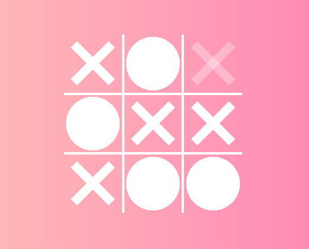

# Jogo da Velha

> Este projeto se trata de um jogo da velha criado para exercitar os conhecimentos adquiridos em JavaScript, CSS e HTML. Foi testado diversas vezes e é possível vencer, perder ou empatar. 
> Ele pode ser acessado em https://marcellemarichal.github.io/jogodavelha/
